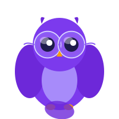
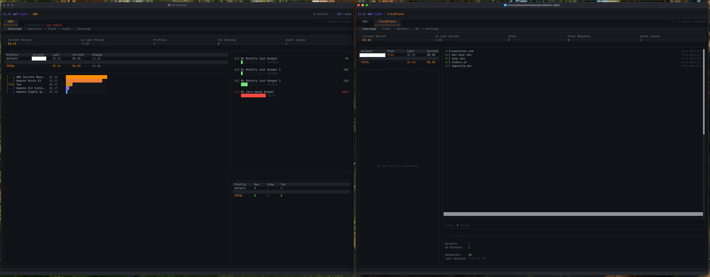

<div align="center">


<h1>owl-sight</h1>

<p align="center">
  <a href="https://github.com/dsqr/owl-sight"></a>
  <a href="#"></a>
  <a href="#"></a>
  <a href="#"></a>
</p>

**Native terminal dashboard for AWS and Cloudflare. Monitor costs, resources, and usage without leaving your terminal.**

</div>


> [!IMPORTANT]
> This is a POC that is under devlopment, you can use open tui to build your own. or if you like nix, it's easy to use.



## Prerequisites

- **AWS**: Configured AWS credentials file (`~/.aws/credentials`) with at least one profile
- **Cloudflare** (optional): Set `CLOUDFLARE_API_TOKEN` environment variable
- **R2 file browsing** (optional): Set `R2_ACCESS_KEY_ID` and `R2_SECRET_ACCESS_KEY`

## Quick Start

While under development, you can clone and run locally:

```bash
git clone https://github.com/dsqr/owl-sight
cd owl-sight
```

If you have nix installed:

```bash
nix develop
bun install
cd packages/tui && bun run dev
```

Otherwise, ensure you have Bun installed and run:

```bash
bun install
cd packages/tui && bun run dev
```